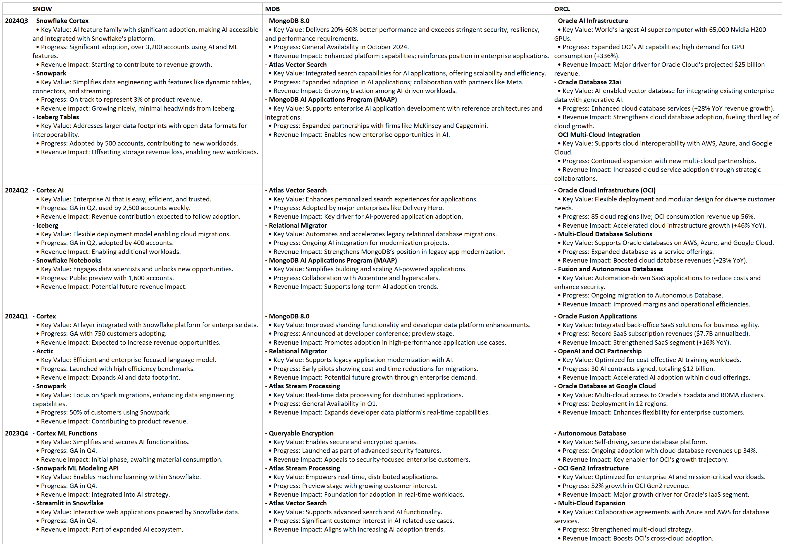

# Industry Trends from MongoDB, Snowflake, and Oracle Product Updates (Q4 2023 - Q3 2024)

## 1. AI and ML Integration Across Platforms
All three companies are heavily investing in AI/ML capabilities to drive innovation and adoption.

- Snowflake introduced products like Snowflake Cortex, Cortex AI, and Iceberg Tables for AI/ML workloads.
- MongoDB emphasized AI applications with Atlas Vector Search and the MongoDB AI Applications Program (MAAP).
- Oracle highlighted AI initiatives like Oracle AI Infrastructure and the integration of AI capabilities in databases with 23ai and Fusion Applications.

This trend reflects the industry's shift toward leveraging AI to enhance data insights, automate processes, and enable advanced analytics.
## 2. Focus on Vector Search and AI Search Capabilities
Vector search emerged as a core offering, tailored for AI and search-related applications:

- Snowflake is moving towards enabling streaming and real-time AI use cases.
- MongoDB's Atlas Vector Search is targeting personalized and scalable search experiences.
- Oracle's 23ai also integrates vector capabilities into enterprise workflows.

This points to the rising demand for efficient search solutions, particularly for AI-driven models and applications.
## 3. Cloud-Native and Multi-Cloud Solutions
Expanding cloud infrastructure remains critical:

- Snowflake continues improving its integration for multi-cloud environments via Iceberg and new features.
- MongoDB focuses on enterprise modernization and database migrations through Atlas services.
- Oracle OCI and Multi-Cloud Database Solutions emphasize flexibility and adoption across AWS, Azure, and Google Cloud.
 
The industry trend underlines the importance of interoperability and scalability in hybrid or multi-cloud architectures.
## 4. Data Security and Compliance
Security and encryption remain top priorities:

- MongoDB highlighted Queryable Encryption as a key feature for secure data management.
- Oracle addressed secure deployment through OCI updates and SaaS integrations.
- Snowflake also improved its platform reliability for compliance-heavy industries.

This trend reflects customer concerns over data security, especially in regulated sectors like finance and healthcare.
## 5. Revenue Growth Through Strategic AI Partnerships
Partnerships and enterprise adoption of AI tools are driving significant revenue opportunities:

- MongoDB partnered with major enterprises like Delivery Hero and consulting firms like McKinsey for AI-driven projects.
- Snowflake and Oracle reported strong revenue growth from new AI capabilities, especially in predictive and automated functionalities.

The trend demonstrates how tailored AI solutions aligned with business needs translate directly into profitability.

# Detailed Product Updates (Q4 2023 - Q3 2024)

