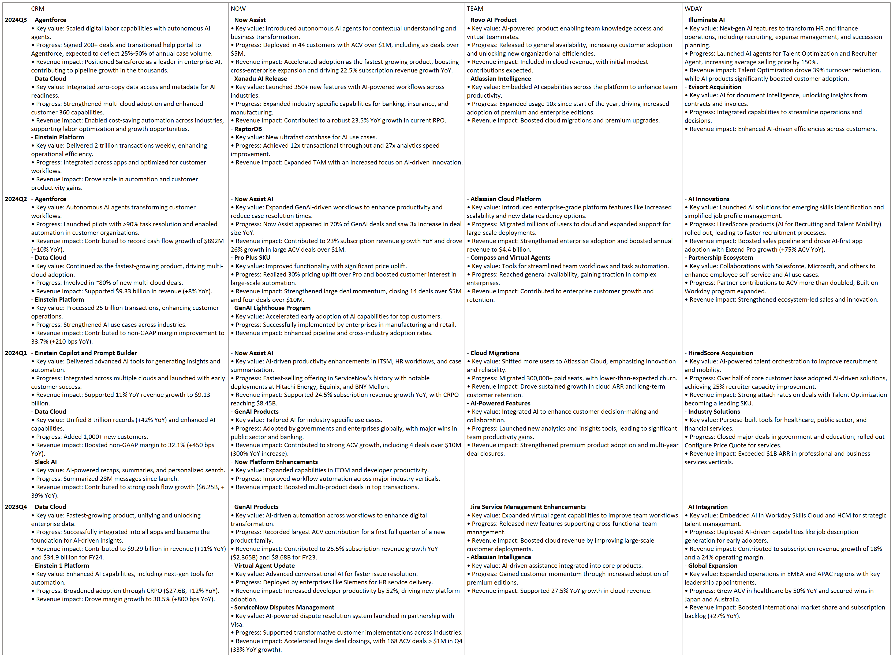
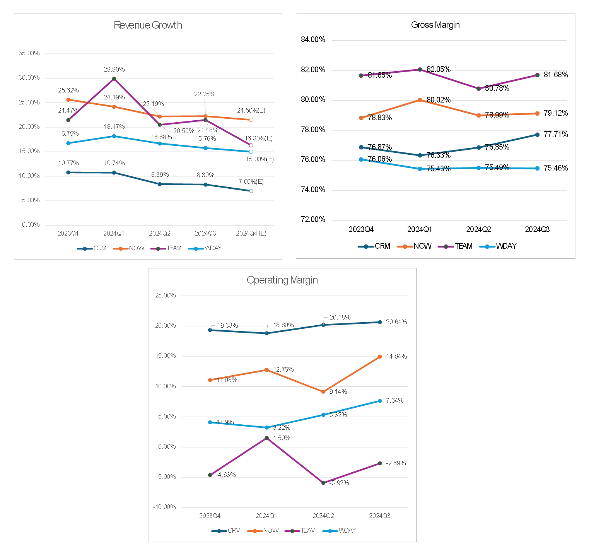

# Industry Trends from Salesforce, ServiceNow, Atlassian, Workday Product Updates (Q4 2023 - Q3 2024)

Over the weekend, I reviewed four SaaS companies—Salesforce, ServiceNow, Atlassian, and Workday—based on their Q3 2024 earnings reports. These companies are all focused on improving workflow efficiency and supporting enterprise digital transformation. In their earnings reports, the implementation of AI Agents was without exception a key focus area. Here are my observations:

1. AI transformation is a consensus at this stage. All companies are doing it. While adopting AI now may not necessarily create a differentiated advantage, not adopting it will likely lead to being eliminated.

2. Hybrid cloud and breaking down data silos between internal and external services remain a trend. Once these barriers are removed, information flows more smoothly, data increases, efficiency improves, and high-quality decision-making is facilitated.

3. Both ServiceNow and Salesforce disclosed AI-related order data, showing stronger certainty. Atlassian and Workday only vaguely mentioned that users are trying out AI.

4. Revenue growth rates for all four companies are still declining. However, ServiceNow’s ability to maintain over 20% growth under a high-interest-rate environment over the past two years is remarkable. The cost of this strength is its consistently high valuation, making it expensive to buy.

5. Their gross and operating margins are either stable or improving, showing that they are also controlling costs. Among these companies, NOW and CRM stand out due to their large scale, market size, strong moats, and high certainty. TEAM and WDAY will need to wait for feedback on their products.

6. Over the past year, stock performance has been:  
   - NOW (+47.27%)  
   - CRM (+20.57%)  
   - TEAM (+4.91%)  
   - WDAY (-11.13%)  
   Stable growth and profitability are very important, especially during economic downturns when customers might cut back on spending. If a company can maintain growth during such times, it demonstrates the necessity of its offerings.

7. From the perspective of the industry chain, upstream players include chip manufacturers, CSP cloud vendors, model vendors, and data infrastructure vendors. Among them, data infrastructure vendors fared the worst last year. They did not benefit from the LLM boom but were instead affected by customers’ cost optimization efforts.

8. If last year’s competition focused on foundational computing power, I believe this year’s AI Agent implementation is about understanding pain points in business scenarios and refining products.

# Detailed Product Updates (Q4 2023 - Q3 2024)

# Detailed Revenue Growth, Gross Margin, Operating Margin  (Q4 2023 - Q3 2024)

